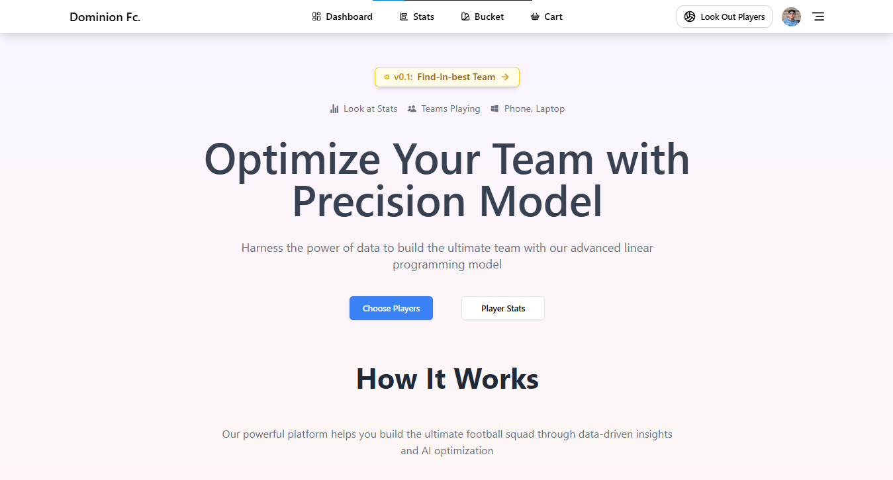
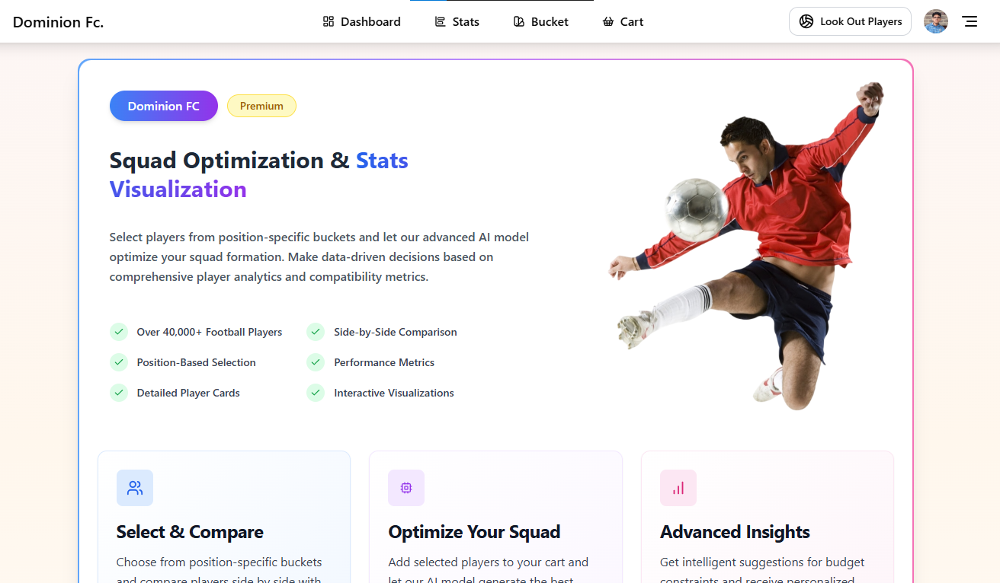
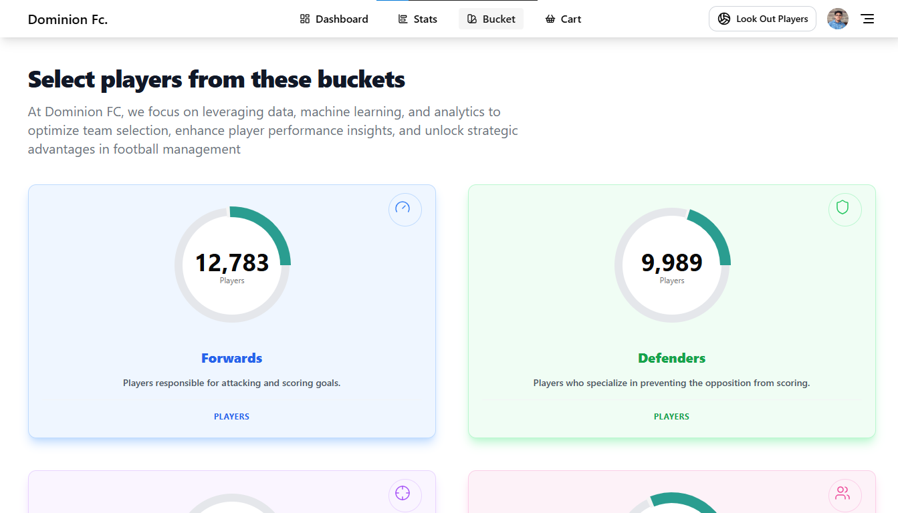
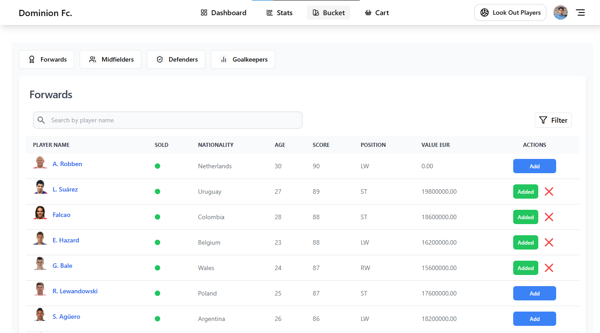
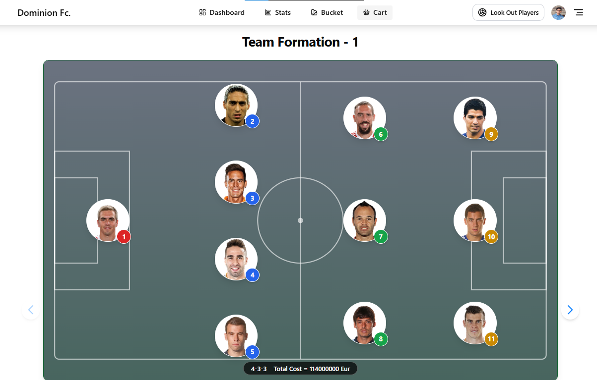
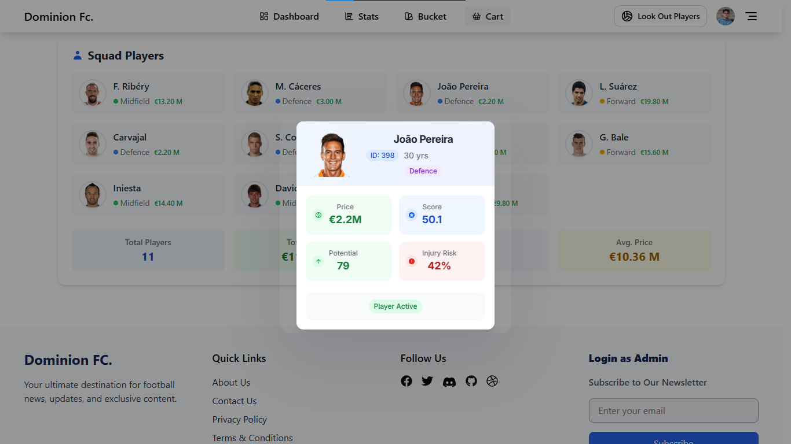

# ⚽ **Dominion FC**  
🔮 *Optimize Your Football Squad with Machine Learning & genAI*  


---

## 🚀 **About the Project**  
**Dominion FC** is a web-based tool designed to help football managers and enthusiasts create the **best possible squad** using advanced **Machine Learning (ML)** and **Optimization Techniques**. The app rates players, predicts their auction cost, and forms the optimal starting XI based on a budget constraint — just like a professional football draft!  

---

## 🌟 **Features**  
✅ **Player Position** – Predicts player position to maximize its performance .  
✅ **Cost Prediction** – Predicts player auction costs using ML models.  
✅ **Linear Programming (Knapsack)** – Applies the **Knapsack algorithm** to form the best squad within a set budget.  
✅ **Position-Specific Buckets** – Organizes players into categories:  
   - 🥅 Goalkeepers  
   - 🛡️ Defenders  
   - 🎯 Midfielders  
   - ⚡ Forwards  

✅ **Comparison and Filters** – Compare players and apply filters for quick decision-making.  
✅ **Interactive Graphs** – View player stats and performance trends through intuitive visualizations.  
✅ **Firebase Authentication** – Secure login using Firebase.  
✅ **Neon Db Integration** – Backend powered by neon for fast and reliable data storage and CRUD operations.  

---

## 🖥️ **Tech Stack**  
| Technology | Description |
|------------|-------------|
| **React** | Frontend framework |
| **Tailwind CSS & Shadcn** | Styling |
| **Web Sockets** | Real Time Updation |
| **Redux and RTK query** | State & API management |
| **Firebase** | Authentication |
| **Neon Db** | database |
| **Python (Flask)** | ML model and backend logic |
| **Knapsack Algorithm** | Optimization for team selection |
| **Render & Vercel** | Deployment platform |

---

## 🎯 **How It Works**  
1. **Login** – Sign in using Firebase authentication.  
2. **Select Players** – Browse and select players from position-specific buckets.  
3. **Optimize Squad** – The app rates and predicts auction cost for each player.  
4. **Linear Programming** – Selects the best possible playing XI while staying within budget.  
5. **View Stats** – Compare player stats and performance through graphs.  
6. **Save & Export** – Save your optimized squad for future reference.  

---

## 📸 **Screenshots**  
### ➡️ **Home Page**  
 


### ➡️ **Player Selection**  



### ➡️ **Team Optimization**  



---

## 🛠️ **Setup Instructions**  
### 1. **Clone the repository**  
```bash
git clone git@github.com:iamdhruvsaini/dominion-fc..git
cd dominion-fc
```

### 2. **Install dependencies**  
```bash
npm install
```

### 3. **Set up environment variables**  
Create a `.env` file in the root and add the following:  

### 4. **Start the development server**  
```bash
npm run dev
```


## 🌍 **Live Demo**  
👉 [**View Live**](https://dominion-fc.onrender.com)  

---

## 👥 **Contributors**  
| Name | GitHub |
|-------|--------|
| Dhruv Saini | [@iamdhruvsaini](https://github.com/iamdhruvsaini) |

---

